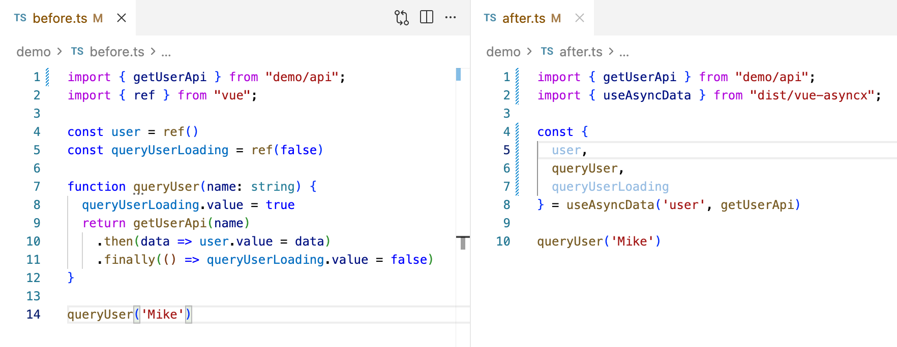
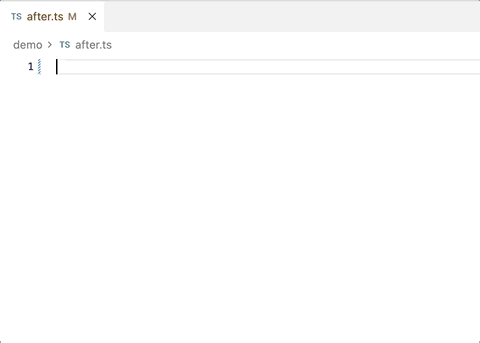
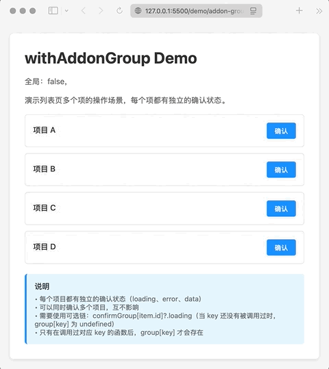

<div align="center">

# Vue Asyncx

**Semantic async composables for Vue**

No duplication, semantically named, race-condition-safe by default, freely extensible

**English** | [简体中文](./README.md)

[](https://www.npmjs.com/package/vue-asyncx)
[](https://www.npmjs.com/package/vue-asyncx)
[](https://github.com/xuyimingwork/vue-asyncx/actions/workflows/test.yml)
[](https://codecov.io/gh/xuyimingwork/vue-asyncx)

📚 [Docs](https://vue-asyncx.js.org/) · 🎮 [Playground](https://www.typescriptlang.org/play/?ts=5.9.3#code/PQKhCgAIUg3BXApgWgIYGcCeA7AxgD0kH95QCldAuT0Gj5QCH-A5uUADvQVWVAGJUFhNQIXNBIf6hgBVMAHRAGVcAJwCW-AC6QACgBtUmAOaiA9vGwATQFj-ACylT+6AFzBgAdysA6KQMToxkqYuzLra0cuD9FmbsDg4OIAtvyeMgDekKKIAGaQAL6QceohkADkCIgZwWERkNHw6IgAglh4ADSQxWUVuAAiqFKo1RbiUnqlWlpq2ADi6vD8SSlpmdlo9fi54OaQALxLyyura+sbm1vb23PAkACM1jUl5Ti4kIAoBJeQgFfKgM6KgMP6gOZGgDIRgG1OgIAGgDD-gLByT4AV+MAe2qAB1NAHbGVEAC8aAErlgIA7D0AJdHAQAESoATNK48x2WOxONx6yCGHOKU0uCk4j6kHQ8AARiEOqV+OIABT8JTyNSoLQmQqQbCoEKIbnoKQSNxJACUhSgkFQFlQHV5iAscjS4hKTKZoklCwAfJTEFIeKFEBopJrqgBWAAMVvF4ulsSk8FE2B54i5h2q1m9rMw7M5SXAiSCuD6wp5VNpHWqkbpUgAMhytOI3DGaXGAKKidSiUYLE51c5MjKxjoZNNRqQM8T20tm6J8gXcjIAWXEAGschK9pBAIRWgH9zHQmf3JtwLABEdcTnJTynHkAAArh5OJcO2J3WmXFPCEmi1xeOgpi8SfT2elj2AEzHWpnPB71BXG6AIH1AKbW4MgAGpIIBT80AR9GAL+KIJfpAgAFSoAvvGfFQgAA5oAHHokBi+znshKG7OAhJ4MSeBkhSygGgAqiUojVkytSiAAkh6wqiso4rcrIqolAAPNE7pCiKs4ANy8vygqUhxYqJHqkTSrK8oyNgSoqmodLqpq2p6iUhrGqa5qQAAzDadoOgazquqxHpkZR1SNnxAAGhGIKIyAACSREZWiJGZgbBuAobYOGRREdUACOSCiJglmiL5-mBUR06jsoIVWWFVlZjmeYFnejTNKgTLShkZHltKeFSEF1bgPafkxUFxZkcgNoHBk9rzAOOhMcmsBwMg4hxBOxUBUFEWzuOOoQYAtHJMcAjU6g14hNbAyCIPIJQ6pEXlWUkiRDSNR5IahG2bQsPbqTepz1A+IGhAKybNIgT6QIAQMbgYAb6aAFeBgAVSoA79GAEI2gAAcoAhNY9ltP3ISGYZRJA-DqHE4jyIg0UBQxaig+D3WCYsSUHal6WQJkwMw2DOSVNKTIKZAuX5YyxZaPEqDwPIUjVTjaOsSEJ3iGd3IikggY1fs12AHAqj1vJ93yAAemgAA6YA0kYPZAHWYNDsOIHja2LL9Ct4j2AAse2FveqUgXKUi4HoF2ALnygBqsYAG8qAGjK90PYAs4mAA2mr3fYrDtYv9HkyA5iOxHExbulV9ruZ5BaiAAQpgADqzS64lt7Iy0qOZGRwdhzrejZWjeOLHqhNESRDnWLAqDyEg4o0zy2u69yDnVMdiCnVIfEs+dwbswHlGQGbFs23b9uO93Gw9haavJVrHRdD0fSDBoIzXJAgDoSoAFhHAIAWJqAHnaFCAG56rzfIA89aAJ4ZgA3ToA015fF3Pcn8sBL1FhpLkq67mg6IIQkWxvLwCE1JWXR0myYgTHUbOwmiXKBUkllTQy-hqLU6d9TKQFKpYKkAAAcWl7Ro0dHpSAZlESAAQjQA+Urcjsu6JyQZnb+1vuIe+1RSH33HsMChfQ74hHhlFSAlCQjxU8JHfaRYMosJTswuhZCH6MmLtETkvQPLcgANrtE6N0MR1D+BMmiJ2TA3ImSoC8OgfG6jlDoAkVaAAuhKQxjc3L8PvkyA4vszEhCZJeJudUWHyIkR0RAIRrDun0QAfmsCOWcgBABiXCuNcE4WFMhcW490B45anxiReeYAA2Ae0dHyABjtQALqaACN9T4F0UwdEZvIQ634F6ACHlEEx9Ynd3PkSOIJIcKulyvGNUVZibSjsIIdiNFi6sjwtybAL836iEKvRRi39ogrmFB02cEj9HcSkGoFo8hen9MWkJKUaMxJAKkqAtUMt5KQKUkaGB8AzRwMvEgnSToXQ8nGVISRZk7JtMQIkWykRulPOQAcMy1R7mREec8uybznmXjMvo6ocyFncgODaFyxCojShucXCWjThSItCsihMSZZyopiui0oXgX6IGwFIdAxcbkZnwIyWIWgcbJHzFHc4D5iw3PLATA0uKhFrMgLksk+cHzcjGU0yRoLIDgvztyK0SRi5VxrnXUQSAaVFTRU04snhSaiHQCyyxPYkVNLxcoAlRL0CQGgoARfjPqQAkY86obz9GAGx-slFKyHV0gIAPa9PiAGg5cEgB6M0AGQqgBqiMAGGRgA1t3AEAA)

[](https://deepwiki.com/xuyimingwork/vue-asyncx)
[![zread](https://img.shields.io/badge/Ask_Zread-_.svg?style=flat&color=00b0aa&labelColor=000000&logo=data%3Aimage%2Fsvg%2Bxml%3Bbase64%2CPHN2ZyB3aWR0aD0iMTYiIGhlaWdodD0iMTYiIHZpZXdCb3g9IjAgMCAxNiAxNiIgZmlsbD0ibm9uZSIgeG1sbnM9Imh0dHA6Ly93d3cudzMub3JnLzIwMDAvc3ZnIj4KPHBhdGggZD0iTTQuOTYxNTYgMS42MDAxSDIuMjQxNTZDMS44ODgxIDEuNjAwMSAxLjYwMTU2IDEuODg2NjQgMS42MDE1NiAyLjI0MDFWNC45NjAxQzEuNjAxNTYgNS4zMTM1NiAxLjg4ODEgNS42MDAxIDIuMjQxNTYgNS42MDAxSDQuOTYxNTZDNS4zMTUwMiA1LjYwMDEgNS42MDE1NiA1LjMxMzU2IDUuNjAxNTYgNC45NjAxVjIuMjQwMUM1LjYwMTU2IDEuODg2NjQgNS4zMTUwMiAxLjYwMDEgNC45NjE1NiAxLjYwMDFaIiBmaWxsPSIjZmZmIi8%2BCjxwYXRoIGQ9Ik00Ljk2MTU2IDEwLjM5OTlIMi4yNDE1NkMxLjg4ODEgMTAuMzk5OSAxLjYwMTU2IDEwLjY4NjQgMS42MDE1NiAxMS4wMzk5VjEzLjc1OTlDMS42MDE1NiAxNC4xMTM0IDEuODg4MSAxNC4zOTk5IDIuMjQxNTYgMTQuMzk5OUg0Ljk2MTU2QzUuMzE1MDIgMTQuMzk5OSA1LjYwMTU2IDE0LjExMzQgNS42MDE1NiAxMy43NTk5VjExLjAzOTlDNS42MDE1NiAxMC42ODY0IDUuMzE1MDIgMTAuMzk5OSA0Ljk2MTU2IDEwLjM5OTlaIiBmaWxsPSIjZmZmIi8%2BCjxwYXRoIGQ9Ik0xMy43NTg0IDEuNjAwMUgxMS4wMzg0QzEwLjY4NSAxLjYwMDEgMTAuMzk4NCAxLjg4NjY0IDEwLjM5ODQgMi4yNDAxVjQuOTYwMUMxMC4zOTg0IDUuMzEzNTYgMTAuNjg1IDUuNjAwMSAxMS4wMzg0IDUuNjAwMUgxMy43NTg0QzE0LjExMTkgNS42MDAxIDE0LjM5ODQgNS4zMTM1NiAxNC4zOTg0IDQuOTYwMVYyLjI0MDFDMTQuMzk4NCAxLjg4NjY0IDE0LjExMTkgMS42MDAxIDEzLjc1ODQgMS42MDAxWiIgZmlsbD0iI2ZmZiIvPgo8cGF0aCBkPSJNNCAxMkwxMiA0TDQgMTJaIiBmaWxsPSIjZmZmIi8%2BCjxwYXRoIGQ9Ik00IDEyTDEyIDQiIHN0cm9rZT0iI2ZmZiIgc3Ryb2tlLXdpZHRoPSIxLjUiIHN0cm9rZS1saW5lY2FwPSJyb3VuZCIvPgo8L3N2Zz4K&logoColor=ffffff)](https://zread.ai/xuyimingwork/vue-asyncx)

</div>

## Features

- Cut async boilerplate by 40%+, so you can focus on business logic
- Related state is generated and named automatically, making the code self-explanatory
- Built-in race-condition handling, preventing data corruption from concurrent requests
- Plugin-based addon architecture — async capabilities are composable and extensible
- SSR-friendly: no browser dependencies, safe and controllable on the server
- Compatible with Vue 3 / Vue 2.7, zero third-party dependencies
- Full TypeScript type design and inference support
- 100% unit test coverage, 300+ cases to keep behavior stable



## Install

```console
pnpm i vue-asyncx
```

## Quick Start

### useAsyncData (async data)

When you need async data named `user`, call `useAsyncData` with the data name and a fetcher. It automatically manages related state such as `data`, `loading`, `arguments`, and `error`.

```ts
import { getUserApi } from './api'
import { useAsyncData } from 'vue-asyncx'

const { 
  user, 
  queryUserLoading,
  queryUser, 
} = useAsyncData('user', getUserApi) // Code as comment: use async data `user`

queryUser('Mike')
```

Learn more: [useAsyncData](https://vue-asyncx.js.org/hooks/use-async-data.html)

### useAsync (async functions)

When you don't need async data and only care about the execution state of an async function: call `useAsync` with the function name and the async function. It automatically manages related state such as `loading`, `arguments`, and `error`.

```ts
import { submitApi } from './api'
import { useAsync } from 'vue-asyncx'

const { 
  submit, 
  submitLoading,
  submitError,
} = useAsync('submit', submitApi) // Code as comment: use async function `submit`

// Form submit
action="@click="submit(formData)"
```

Learn more: [useAsync](https://vue-asyncx.js.org/hooks/use-async.html)

## Design Philosophy: Convention Brings Efficiency

Unlike [`useRequest`](https://ahooks.js.org/hooks/use-request/index), which returns fixed names like `data`, `loading`, and `error`, `useAsyncData` names related functions and variables together:

- `user`: the `data` updated by the async function
- `queryUser`: the async function that updates `user`
- `queryUserLoading`: the `loading` state when calling `queryUser`

It may feel unfamiliar at first, but this approach improves both readability and productivity — especially in large projects and multi-person teams.

When you see `queryUserLoading` in the code, you immediately know it is related to the `user` variable and the `queryUser` function.

And all of this comes with autocomplete.




Learn more: [Naming Convention](https://vue-asyncx.js.org/introduction.html#naming-convention)

## Advanced Example: Parallel Calls with the Same Semantics

In some scenarios, the same async operation needs to be invoked **in parallel, multiple times, in groups** (for example, several buttons in a list triggering the same action).

`vue-asyncx` supports this via the `withAddonGroup` plugin.



👉 Use cases: list actions / batch operations / multi-instance async

```ts
const { 
  confirm, 
  confirmGroup 
} = useAsync('confirm', confirmApi, {
  addons: [
    withAddonGroup({
      key: (args) => args[0], // Use the first argument as the group key
    }),
  ],
})
```

Learn more: [withAddonGroup](https://vue-asyncx.js.org/addons/group.html)

## Compatibility

- TS >= 5.4; can be relaxed to TS >= 4.1
- Vue 3.x / 2.7
