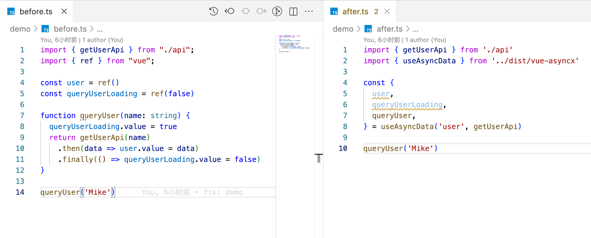
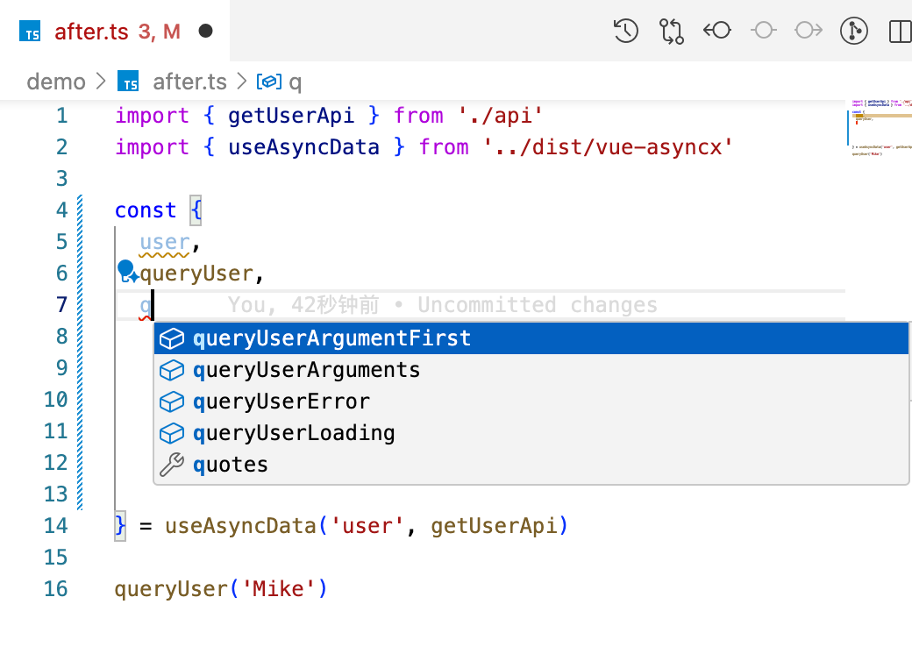

Vue 3 异步工具库

让异步像写诗：不重复、有语义，天然防竞态、自由可扩展 [](https://deepwiki.com/xuyimingwork/vue-asyncx)



## 特性

- 异步相关样板代码减少40%+
- 关联状态变量自动命名、风格统一
- 竟态条件自动处理
- 完整 TS 类型支持
- 100% 单测覆盖率，200+ 测试用例

## 安装

```console
pnpm i vue-asyncx
```

## 快速开始

### useAsyncData (异步数据管理)

需要使用异步数据 `user` 时，调用 `useAsyncData` 传入数据名和数据获取函数即可。`useAsyncData` 会自动处理与异步函数相关的 `data`, `loading`, `arguments`, `error` 等状态。

```ts
import { getUserApi } from './api'
import { useAsyncData } from 'vue-asyncx'

const { 
  user, 
  queryUserLoading,
  queryUser, 
} = useAsyncData('user', getUserApi) // 代码即注释：使用异步数据 user

queryUser('Mike')
```

### useAsync (异步函数管理)

当不需要异步数据，只关注异步函数的执行状态时：调用 `useAsync` 传入函数名和异步函数即可。`useAsync` 会自动处理与该异步函数相关的 `loading`, `arguments`, `error` 等状态。

```ts
import { submitApi } from './api'
import { useAsync } from 'vue-asyncx'

const { 
  submit, 
  submitLoading,
  submitError,
} = useAsync('submit', submitApi) // 代码即注释：使用异步函数 submit

// 表单提交
action="@click="submit(formData)"
```

## 设计哲学：约定带来效率

与 [`useRequest`](https://ahooks.js.org/hooks/use-request/index) 返回固定的 `data`、`loading`、`error` 不同，`useAsyncData` 将关联的函数、变量统一命名：

- `user`：由异步函数更新的数据 `data`
- `queryUser`：更新 `user` 的异步函数
- `queryUserLoading`：调用 `queryUser` 时的 `loading` 状态

刚接触可能有些不习惯，但这种方式带来可读性和效率的双重提升，在大型项目、多人团队中尤为明显。

代码中看到 `queryUserLoading` 变量，就知道它和 `user` 变量以及 `queryUser` 函数有关。



并且这一切，都可以自动提示。

## 用法

`useAsyncData` 与 `useAsync` 配置一致，只是 `useAsyncData` 多了一些与数据相关的配置和状态。

### 立即执行

默认情况下，异步函数需要手动调用，可以设置 `options.immediate = true` 自动触发异步函数。

```ts
const { 
  user, 
  queryUserLoading 
} = useAsyncData('user', getUserApi, { immediate: true })
```

### watch 执行

除了 `immediate`，`useAsyncData` 还完整支持 [vue watch](https://vuejs.org/api/reactivity-core.html#watch)

#### `options.watch` 配置 watch source

```ts
import { getUserApi } from './api'
import { useAsyncData } from 'vue-asyncx'

const props = defineProps<{
  userId: string;
}>();

const { user } = useAsyncData('user', () => getUserApi(props.userId), { 
  watch: () => props.userId,
  immediate: true
})
```

`useAsyncData` 会立即执行，并在每次 `props.userId` 变化时执行。

上面的写法等价于：

```ts
const { user, queryUser } = useAsyncData('user', () => getUserApi(props.userId))
watch(() => props.userId, () => queryUser(), { immediate: true })
```

#### `options.watchOptions` 配置 watch options

```ts
const { user } = useAsyncData('user', () => getUserApi(props.userId), { 
  watch: () => props.userId,
  watchOptions: {
    once: true, // 此处用 once 举例，支持所有 vue watch options 内的配置
  }
})
```

> 注：`options.watchOptions.immediate` 优先级高于 `options.immediate`

#### `options.watchOptions.handlerCreator` 配置 watch handler

```ts
const { 
  user,
  queryUser 
} = useAsyncData('user', (userId) => getUserApi(userId), { 
  watch: () => props.userId,
  immediate: true,
  watchOptions: {
    // fn 等价于 queryUser
    handlerCreator(fn) {
      // handlerCreator 需要返回 watch 的 handler
      return (newId, oldId, onCleanup) => {
        // handler 用法与 vue watch handler 一致，可以排除某些非法调用
        if (!newId) return
        fn(newId)
      }
    },
  }
})
```

### 初始数据配置

```ts
const { user } = useAsyncData('user', getUserApi, { 
  // 未配置时，user 首次调用前为 undefined
  initialData: {} 
})
```

### 在执行过程中更新

`{name}` 数据通常在异步函数调用执行结束时更新，但也可以在异步函数执行过程中更新。

```js
import { getAsyncDataContext, useAsyncData } from 'vue-asyncx'

const wait = (ms: number) => new Promise((resolve) => setTimeout(resolve, ms))

const { 
  progress,
  queryProgress
} = useAsyncData('progress', async (init?: number = 0) => {
  const { getData, updateData } = getAsyncDataContext()
  // 同步更新为入参 10
  updateData(init)
  await wait(100)
  // 间隔 100ms 后，更新为 50
  updateData(50)
  await wait(100)
  // 间隔 100ms 后，返回 100，本次异步函数完全结束。
  return 100
})

queryProgress(10)
```

> - `getAsyncDataContext` 只在同步调用时才可获取到正确的上下文
> - `getData`、`updateData` 内部均已自动处理竟态条件，可以放心调用

### Debounce / Throttle

```ts
import { debounce } from 'es-toolkit';

const { 
  user, 
  queryUser 
} = useAsyncData('user', getUserApi, { 
  immediate: true,
  setup(fn) {
    // throttle 配置方式一致
    return debounce(fn, 500)
  }
})
```

上面例子中，`queryUser` 等价于 `debounce(fn, 500)`。可以使用任意你喜欢的 `debounce` 函数

> `fn` 是 `useAsyncData` 内部对 `getUserApi` 做的封装。`setup` 返回值为函数类型时，会成为最终返回的 `queryUser`。

### DOM/BOM 事件监听 / 轮询

```ts
import { debounce } from "es-toolkit"
import { useEventListener, useIntervalFn } from '@vueuse/core'

const { 
  user, 
  queryUser 
} = useAsyncData('user', getUserApi, {
  immediate: true,
  setup(fn) {
    useEventListener(document, 'visibilitychange', fn)
    useIntervalFn(fn, 1000)
    useEventListener('resize', debounce(fn, 500))
  }
})
```

在 `setup` 中可以像在 vue 组件的 `setup` 中一样注册外部监听器。在上面的例子中，`queryUser` 会：

- 立即调用
- 文档显示隐藏时调用
- 间隔 1s 轮询
- 窗口尺寸变化时调用（`debounce` 版本）

注意到：`setup` 没返回函数，此时 `queryUser` === `fn`。

> 注意，如果没有使用 `useEventListener` 等自动卸载的工具函数，你需要使用 vue 生命周期钩子手动卸载。

## 竟态处理

当一个异步函数被连续快速调用多次时，可能会出现**竟态条件**（Race Condition）—— 后发起的请求可能先返回，导致数据混乱。

`vue-asyncx` 内置了自动的竟态处理机制，确保状态只和最后发起的操作关联，无需手动处理。

### 基本场景

```ts
const { user, queryUser, queryUserLoading, queryUserError } = useAsyncData('user', getUserApi)

// 场景：快速连续调用两次 API
queryUser('user1')  // 调用 A => 较慢，后结束
queryUser('user2')  // 调用 B（最后发起的调用）=> 较快，先结束
```

- `queryUserLoading` 将始终反映 `user2` 调用的加载状态，因为它是后发起的调用。
- `queryUserError` 将始终反映 `user2` 调用的错误状态，因为它是后发起的调用。
- `user` 在正常情况下，将反映 `user2` 调用的数据，因为它是后发起的调用。

### 数据过期

考虑失败场景，情况会更复杂一点，例如：

```ts
queryUser('user1')  // 调用 A => 较慢，后结束且成功
queryUser('user2')  // 调用 B（最后发起的调用）=> 较快，先结束但失败
```

- `queryUserLoading` 与 `user2` 调用绑定，随 `user2` 调用的加载状态而变化，没有问题
- `queryUserError` 与 `user2` 调用绑定，展示 `user2` 调用的报错信息，也符合预期

但是 `user` 在 `user2` 失败场景下，应该保持初始数据，还是更新为 `user1` 调用成功后的数据呢？

目前的设计是：在 `user1` 调用结束后， `user` 会从初始数据更新为 `user1` 调用成功后的数据。

为什么？

- 对于 `user2` 调用而言，失败后，不论是初始数据还是 `user1` 数据，都是错误的过期数据。
- 但对于整个场景而言，`user1` 数据相比初始数据是较新的数据，有更多的价值。

> 比如 `queryUser` 是查询同一个用户的最新状态而不是不同的用户，那么即便不是最后调用的结果，也是值得展示的。

因此，`useAsyncData` 提供了 `{name}Expired` 属性，用于标识当前数据是否过期：

```ts
const { user, userExpired, queryUser, queryUserLoading, queryUserError } = useAsyncData('user', getUserApi)

queryUser('user1')  // 调用 A => 较慢，后结束且成功
queryUser('user2')  // 调用 B（最后发起的调用）=> 较快，先结束但失败
```

在上面的异步操作全部执行完后：

- `queryUserLoading` 为 `user2` 调用结束的 `false`
- `queryUserError` 为 `user2` 调用报错的 `error`
- `user` 为 `user1` 调用成功后的数据
- `userExpired` 为 `true`

#### 与失败的区别

`queryUserError` 与 `userExpired` 有联系但不是一回事。`queryUserError` 与调用相关，而 `userExpired` 与数据相关。

比如在上面的场景后，又发起了 `queryUser('user3')` 调用。

- 在 `queryUser('user3')` 发起后，`queryUserError` 立即置空。
- `userExpired` 保持 `true` 直到 `queryUser('user3')` 调用成功：
  - `user` 会从过期的 `user1` 数据更新为 `user3` 数据。
  - `userExpired` 自动变为 `false`。

## API

### useAsyncData

#### 响应

| 属性                     | 描述                            | 类型             | 默认值    |
| ------------------------ | ------------------------------- | ---------------- | --------- |
| {name}                   | 异步函数的返回数据              | `Ref<any>` \| `ShallowRef<any>` | undefined |
| query{Name}Loading       | 异步函数执行时的加载状态        | `Ref<boolean>`          | false     |
| query{Name}Arguments     | 异步函数执行时的传入的参数列表  | `ComputedRef<any[]>`      | []        |
| query{Name}ArgumentFirst | 异步函数执行时的传入的首个参数 | `ComputedRef<any>`        | undefined |
| query{Name}Error         | 异步函数执行时的异常            | `Ref<any>`               | undefined |
| {name}Expired            | 数据是否过期             | `Ref<boolean>`          | false     |

#### 配置

| 配置名                      | 描述                                                  | 类型                                                    | 默认值    |
| --------------------------- | ----------------------------------------------------- | ------------------------------------------------------- | --------- |
| immediate                   | 是否立即执行                                          | boolean                                                 | false     |
| watch                       | 传入 vue watch 的侦听数据源，发生变动时执行 `handler` | 与 vue WatchSource 一致                                 | -         |
| watchOptions                | 传入 vue watch 的配置项                               | 支持全部 vue WatchOptions，另有 `handlerCreator` 配置项 | -         |
| watchOptions.handlerCreator | 自定义传入 `watch` 的 `handler`                       | `(fn: Fn) => WatchCallback`                             | -         |
| initialData                 | data 的初始值                                         | any                                                     | undefined |
| shallow                     | 是否使用 `shallowRef` 保存 data，默认使用 `ref`       | boolean                                                 | false     |
| setup                       | 转换函数或执行其它初始化操作                          | `(fn: Fn) => ((...args: any) => any) \\| void`           | -         |
| enhanceFirstArgument        | 是否将上下文增强到第一个参数 (已废弃，请使用`getAsyncDataContext`获取上下文)                  | boolean                                                 | false     |

### useAsync

#### 响应

| 属性                     | 描述                            | 类型             | 默认值    |
| ------------------------ | ------------------------------- | ---------------- | --------- |
| {name}                   | 包装后的异步函数                | Function         | -         |
| {name}Loading            | 异步函数执行时的加载状态        | `Ref<boolean>`     | false     |
| {name}Arguments          | 异步函数执行时的传入的参数列表  | `ComputedRef<any[]>` | []        |
| {name}ArgumentFirst      | {name}Arguments 的首个参数      | `ComputedRef<any>` | undefined |
| {name}Error              | 异步函数执行时的异常            | `Ref<any>`         | undefined |

#### 配置

| 配置名                      | 描述                                                  | 类型                                                    | 默认值    |
| --------------------------- | ----------------------------------------------------- | ------------------------------------------------------- | --------- |
| immediate                   | 是否立即执行                                          | boolean                                                 | false     |
| watch                       | 传入 vue watch 的侦听数据源，发生变动时执行 `handler` | 与 vue WatchSource 一致                                 | -         |
| watchOptions                | 传入 vue watch 的配置项                               | 支持全部 vue WatchOptions，另有 `handlerCreator` 配置项 | -         |
| watchOptions.handlerCreator | 自定义传入 `watch` 的 `handler`                       | `(fn: Fn) => WatchCallback`                             | -         |
| setup                       | 转换函数或执行其它初始化操作                          | `(fn: Fn) => ((...args: any) => any) \\| void`           | -         |

