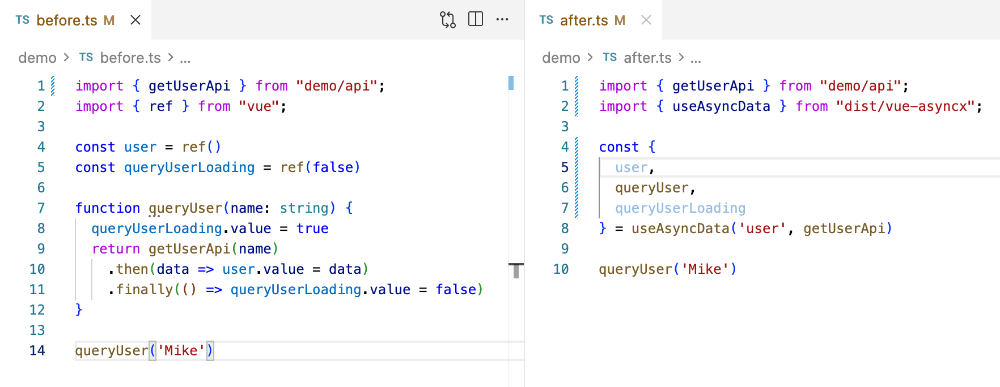
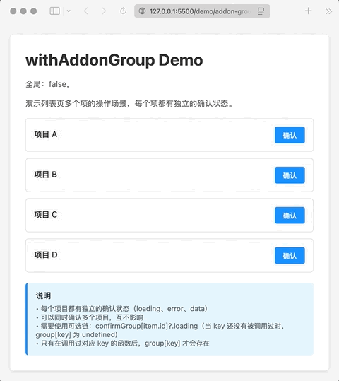

让异步像写诗的 Vue 3 组合式工具库 [](https://deepwiki.com/xuyimingwork/vue-asyncx) [![zread](https://img.shields.io/badge/Ask_Zread-_.svg?style=flat&color=00b0aa&labelColor=000000&logo=data%3Aimage%2Fsvg%2Bxml%3Bbase64%2CPHN2ZyB3aWR0aD0iMTYiIGhlaWdodD0iMTYiIHZpZXdCb3g9IjAgMCAxNiAxNiIgZmlsbD0ibm9uZSIgeG1sbnM9Imh0dHA6Ly93d3cudzMub3JnLzIwMDAvc3ZnIj4KPHBhdGggZD0iTTQuOTYxNTYgMS42MDAxSDIuMjQxNTZDMS44ODgxIDEuNjAwMSAxLjYwMTU2IDEuODg2NjQgMS42MDE1NiAyLjI0MDFWNC45NjAxQzEuNjAxNTYgNS4zMTM1NiAxLjg4ODEgNS42MDAxIDIuMjQxNTYgNS42MDAxSDQuOTYxNTZDNS4zMTUwMiA1LjYwMDEgNS42MDE1NiA1LjMxMzU2IDUuNjAxNTYgNC45NjAxVjIuMjQwMUM1LjYwMTU2IDEuODg2NjQgNS4zMTUwMiAxLjYwMDEgNC45NjE1NiAxLjYwMDFaIiBmaWxsPSIjZmZmIi8%2BCjxwYXRoIGQ9Ik00Ljk2MTU2IDEwLjM5OTlIMi4yNDE1NkMxLjg4ODEgMTAuMzk5OSAxLjYwMTU2IDEwLjY4NjQgMS42MDE1NiAxMS4wMzk5VjEzLjc1OTlDMS42MDE1NiAxNC4xMTM0IDEuODg4MSAxNC4zOTk5IDIuMjQxNTYgMTQuMzk5OUg0Ljk2MTU2QzUuMzE1MDIgMTQuMzk5OSA1LjYwMTU2IDE0LjExMzQgNS42MDE1NiAxMy43NTk5VjExLjAzOTlDNS42MDE1NiAxMC42ODY0IDUuMzE1MDIgMTAuMzk5OSA0Ljk2MTU2IDEwLjM5OTlaIiBmaWxsPSIjZmZmIi8%2BCjxwYXRoIGQ9Ik0xMy43NTg0IDEuNjAwMUgxMS4wMzg0QzEwLjY4NSAxLjYwMDEgMTAuMzk4NCAxLjg4NjY0IDEwLjM5ODQgMi4yNDAxVjQuOTYwMUMxMC4zOTg0IDUuMzEzNTYgMTAuNjg1IDUuNjAwMSAxMS4wMzg0IDUuNjAwMUgxMy43NTg0QzE0LjExMTkgNS42MDAxIDE0LjM5ODQgNS4zMTM1NiAxNC4zOTg0IDQuOTYwMVYyLjI0MDFDMTQuMzk4NCAxLjg4NjY0IDE0LjExMTkgMS42MDAxIDEzLjc1ODQgMS42MDAxWiIgZmlsbD0iI2ZmZiIvPgo8cGF0aCBkPSJNNCAxMkwxMiA0TDQgMTJaIiBmaWxsPSIjZmZmIi8%2BCjxwYXRoIGQ9Ik00IDEyTDEyIDQiIHN0cm9rZT0iI2ZmZiIgc3Ryb2tlLXdpZHRoPSIxLjUiIHN0cm9rZS1saW5lY2FwPSJyb3VuZCIvPgo8L3N2Zz4K&logoColor=ffffff)](https://zread.ai/xuyimingwork/vue-asyncx)


**不重复、有语义，天然防竞态、自由可扩展**



官方文档：[Vue Asyncx](https://xuyimingwork.github.io/vue-asyncx/)

## 特性

- 异步相关样板代码减少40%+
- 关联状态变量自动命名、风格统一
- 竞态条件自动处理
- 插件化 addon 架构：可扩展的异步能力
- 完整 TS 类型支持
- 100% 单测覆盖率，300+ 测试用例

## 安装

```console
pnpm i vue-asyncx
```

## 快速开始

### useAsyncData (异步数据管理)

需要使用异步数据 `user` 时，调用 `useAsyncData` 传入数据名和数据获取函数即可。`useAsyncData` 会自动处理与异步函数相关的 `data`, `loading`, `arguments`, `error` 等状态。

```ts
import { getUserApi } from './api'
import { useAsyncData } from 'vue-asyncx'

const { 
  user, 
  queryUserLoading,
  queryUser, 
} = useAsyncData('user', getUserApi) // 代码即注释：使用异步数据 user

queryUser('Mike')
```

更多内容，见：[useAsyncData](https://xuyimingwork.github.io/vue-asyncx/hooks/use-async-data.html)

### useAsync (异步函数管理)

当不需要异步数据，只关注异步函数的执行状态时：调用 `useAsync` 传入函数名和异步函数即可。`useAsync` 会自动处理与该异步函数相关的 `loading`, `arguments`, `error` 等状态。

```ts
import { submitApi } from './api'
import { useAsync } from 'vue-asyncx'

const { 
  submit, 
  submitLoading,
  submitError,
} = useAsync('submit', submitApi) // 代码即注释：使用异步函数 submit

// 表单提交
action="@click="submit(formData)"
```

更多内容，见：[useAsync](https://xuyimingwork.github.io/vue-asyncx/hooks/use-async.html)

## 设计哲学：约定带来效率

与 [`useRequest`](https://ahooks.js.org/hooks/use-request/index) 返回固定的 `data`、`loading`、`error` 不同，`useAsyncData` 将关联的函数、变量统一命名：

- `user`：由异步函数更新的数据 `data`
- `queryUser`：更新 `user` 的异步函数
- `queryUserLoading`：调用 `queryUser` 时的 `loading` 状态

刚接触可能有些不习惯，但这种方式带来可读性和效率的双重提升，在大型项目、多人团队中尤为明显。

代码中看到 `queryUserLoading` 变量，就知道它和 `user` 变量以及 `queryUser` 函数有关。

并且这一切，都可以自动提示。


更多内容，见：[命名约定](https://xuyimingwork.github.io/vue-asyncx/introduction.html#naming-convention)

## 高级用法示例：并行同语义操作

在一些场景中，同一个异步操作可能需要分组**并行多次调用**（例如列表中多个按钮触发同一操作）。

`vue-asyncx` 通过 `withAddonGroup` 插件提供支持



👉 适用于：列表操作 / 批量操作 / 多实例异步

```ts
const { 
  confirm, 
  confirmGroup 
} = useAsync('confirm', confirmApi, {
  addons: [
    withAddonGroup({
      key: (args) => args[0], // 使用第一个参数作为分组 key
    }),
  ],
})
```

详细内容，见：[withAddonGroup](https://xuyimingwork.github.io/vue-asyncx/addons/group.html)