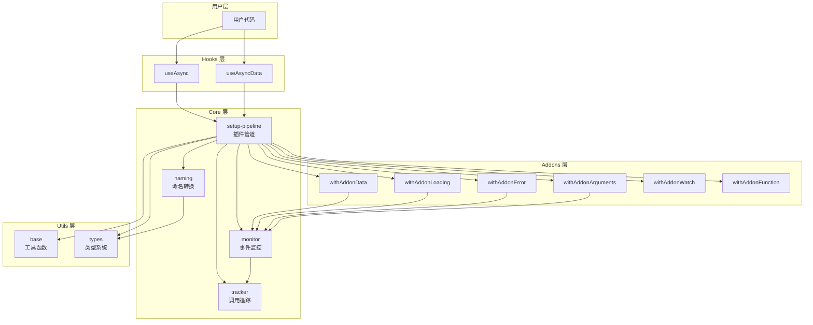
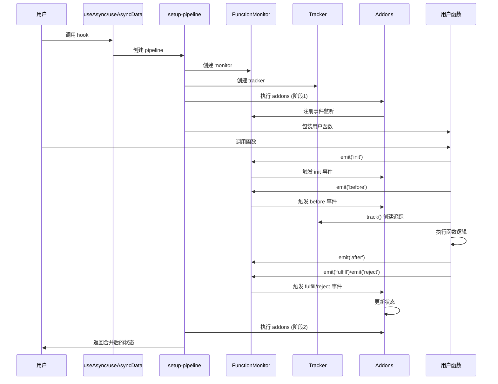

# Vue-AsyncX 架构设计文档

## 一、概述

### 1.1 项目定位

Vue-AsyncX 是一个专为 Vue 3 设计的异步函数和数据管理工具库。它通过约定优于配置的设计理念，大幅减少异步相关的样板代码，提供统一的命名约定和自动的竟态处理能力。

### 1.2 设计目标

1. **减少样板代码**：自动处理 `loading`、`error`、`data` 等状态，减少 40%+ 的样板代码
2. **统一命名约定**：通过命名约定建立变量之间的关联关系，提升代码可读性
3. **竟态安全**：内置竟态条件处理机制，确保状态与最新调用关联
4. **类型安全**：完整的 TypeScript 类型支持，提供优秀的开发体验
5. **可扩展性**：基于插件化架构，支持通过 Addon 扩展功能

### 1.3 核心概念

- **Hook**：对外提供的组合式函数，如 `useAsync`、`useAsyncData`
- **Addon**：插件系统，用于扩展功能（如 `withAddonLoading`、`withAddonError`）
- **Monitor**：事件监控系统，用于监听函数执行的生命周期
- **Tracker**：调用追踪系统，用于处理竟态条件和状态管理
- **Pipeline**：插件管道系统，负责组织和执行插件

## 二、架构总览

### 2.1 整体架构



### 2.2 模块划分

项目采用分层架构，主要分为以下层次：

1. **Hooks 层** (`src/hooks/`)：对外 API，提供 `useAsync` 和 `useAsyncData`
2. **Core 层** (`src/core/`)：核心功能，包括监控、追踪、管道、命名系统
3. **Addons 层** (`src/addons/`)：插件系统，提供各种功能扩展
4. **Utils 层** (`src/utils/`)：工具函数和类型定义

### 2.3 数据流图



## 三、核心模块详解

### 3.1 Core 层

#### 3.1.1 monitor.ts - 事件监控系统

**职责**：提供函数执行生命周期的事件发布订阅机制。

**核心接口**：
- `FunctionMonitor`：事件监控器接口
- `withFunctionMonitor`：包装函数，添加监控能力

**事件类型**：
- `init`：函数调用初始化，用于准备上下文
- `before`：函数执行前，用于观察逻辑
- `after`：函数执行后（同步部分完成）
- `fulfill`：函数成功完成
- `reject`：函数执行失败

**设计要点**：
- 使用 `Map` 和 `Set` 管理事件处理器，支持多个监听器
- 事件顺序：`init` → `before` → `after` → `fulfill`/`reject`

**内部实现细节**：
- `enhance-arguments` 是内部 API，仅用于兼容功能（如已废弃的 `enhanceFirstArgument`），不对外暴露
- 使用特殊的拦截器机制，只允许一个拦截器
- 在 `before` 事件之后、函数执行之前触发

#### 3.1.2 tracker.ts - 调用追踪和竟态处理

**职责**：追踪每次函数调用，管理调用状态，处理竟态条件。

**核心概念**：
- **Track**：单次调用的追踪对象，包含序号（sn）和状态
- **Tracker**：追踪器，管理所有调用的状态
- **状态机**：PENDING → FULFILLED/REJECTED

**状态定义**：
```typescript
type TrackState = 'pending' | 'fulfilled' | 'rejected'
type TrackQueryState = TrackState | 'finished'
```

**状态说明**：
- `pending`：初始状态，调用已创建但未完成
- `fulfilled`：成功完成状态（终态）
- `rejected`：执行失败状态（终态）
- `finished`：查询专用状态，表示已完成（`fulfilled` 或 `rejected`），不参与状态转换

**状态转换规则**：
- `pending` → `fulfilled`/`rejected`
- `fulfilled` → []（终态，不允许转换）
- `rejected` → []（终态，不允许转换）

**竟态处理原理**：
1. 每次调用分配唯一序号（sn），严格递增
2. 需要的 addon 自行维护状态，通过比较 sn 来判断调用顺序
3. 只有最新调用的状态才会更新到最终结果

**关键方法**：
- `track()`：创建新的追踪对象，分配唯一序号
- `is(state?)`：检查当前是否处于指定状态

#### 3.1.3 setup-pipeline.ts - 插件管道系统

**职责**：组织和执行插件（Addon），合并插件返回的状态。

**执行流程**：
1. 创建 monitor 和 tracker
2. **阶段一**：执行所有 addon，收集基础状态和高级 addon
3. 执行 `useSetup` 包装函数
4. **阶段二**：执行高级 addon（需要访问最终 method 的 addon）
5. 合并所有状态并返回

**两阶段执行机制**：
- **基础 Addon**：直接返回对象，仅参与阶段一
- **高级 Addon**：返回函数，参与阶段一和阶段二，可以访问最终的 method

**状态合并**：
- 使用 `mergeAddonResults` 合并插件返回的状态
- 检测重复键，抛出错误防止冲突
- 支持类型安全的合并

#### 3.1.4 naming.ts - 命名转换系统

**职责**：将插件返回的属性名中的 `__name__` 占位符替换为实际名称。

**转换规则**：
- `__name__` 在开头：替换为小驼峰（如 `__name__Loading` → `userLoading`）
- `__name__` 在中间：替换为大驼峰（如 `query__name__` → `queryUser`）
- 不包含 `__name__` 的属性：默认丢弃（可通过配置保留）

**设计目的**：
- 统一命名风格
- 建立变量之间的关联关系
- 支持类型推导

### 3.2 Addons 层

#### 3.2.1 插件系统设计

**Addon 类型定义**：
```typescript
type Addon<Method, AddonResult> = (params: {
  monitor: FunctionMonitor,
  _types: AddonTypes<Method>
}) => AddonResult | ((params: { method: Method }) => AddonResult)
```

**插件执行时机**：
- **阶段一**：所有插件都会执行，可以注册事件监听器
- **阶段二**：只有返回函数的插件会执行，可以访问最终的 method

#### 3.2.2 内置插件说明

1. **withAddonLoading**：管理加载状态
   - 监听 `before`、`fulfill`、`reject` 事件
   - 返回 `{ __name__Loading: Ref<boolean> }`

2. **withAddonError**：管理错误状态
   - 监听 `before`、`reject` 事件
   - 返回 `{ __name__Error: Ref<any> }`

3. **withAddonArguments**：追踪函数参数
   - 监听 `before`、`fulfill`、`reject` 事件
   - 返回 `{ __name__Arguments: ComputedRef, __name__ArgumentFirst: ComputedRef }`

4. **withAddonData**：管理数据状态（高级 Addon）
   - 阶段一：注册事件监听，创建响应式数据
   - 阶段二：返回数据对象
   - 支持中途更新数据（通过 `getAsyncDataContext`）
   - 返回 `{ __name__: Ref, __name__Expired: Ref<boolean> }`

5. **withAddonFunction**：返回包装后的函数（高级 Addon）
   - 阶段二：返回 `{ __name__: Method }`

6. **withAddonWatch**：自动监听并执行（高级 Addon）
   - 阶段二：设置 watch，自动触发函数执行

### 3.3 Hooks 层

#### 3.3.1 useAsync 实现

**功能**：管理异步函数的执行状态，不管理数据。

**内置插件**：
- `withAddonLoading`
- `withAddonError`
- `withAddonArguments`
- `withAddonFunction`
- `withAddonWatch`（如果配置了 watch）

**返回属性**：
- `{name}`：包装后的函数
- `{name}Loading`：加载状态
- `{name}Error`：错误状态
- `{name}Arguments`：参数列表
- `{name}ArgumentFirst`：首个参数

#### 3.3.2 useAsyncData 实现

**功能**：管理异步数据，包含 `useAsync` 的所有功能，额外管理数据状态。

**实现方式**：基于 `useAsync`，添加 `withAddonData` 插件。

**返回属性**：
- `useAsync` 的所有属性
- `{name}`：数据（Ref）
- `{name}Expired`：数据是否过期（Ref<boolean>）

**数据过期机制**：
- 当最新调用失败，但之前调用成功时，数据标记为过期
- 用于标识数据可能不是最新的

### 3.4 Utils 层

#### 3.4.1 工具函数

- `base.ts`：基础工具函数（如 `message`、`warn`、`getFunction`）
- `types.ts`：类型工具（如 `CamelReplace`、`MergeTypes`、`ObjectShape`）

#### 3.4.2 类型系统

**核心类型工具**：
- `CamelReplace`：驼峰替换工具，用于命名转换
- `MergeTypes`：类型合并工具，用于合并插件返回类型
- `ObjectShape`：提取对象形状，过滤非对象类型
- `IsUnion`：判断是否为联合类型

**类型推导流程**：
1. 从函数参数推导 `Fn` 类型
2. 将 `Fn` 传入 Addon 类型系统
3. 收集所有 Addon 的返回类型
4. 合并返回类型，检测重复键
5. 应用命名转换，生成最终类型

## 四、关键设计决策

### 4.1 为什么选择插件化架构

1. **可扩展性**：新功能可以通过插件添加，无需修改核心代码
2. **可组合性**：用户可以选择需要的功能，避免功能膨胀
3. **可测试性**：每个插件独立测试，降低测试复杂度
4. **类型安全**：通过类型系统确保插件返回类型的正确性

### 4.2 竟态处理的实现原理

**问题**：快速连续调用异步函数时，后发起的请求可能先返回，导致数据混乱。

**解决方案**：
1. 每次调用分配唯一序号（sn）
2. 记录每种状态的最新序号
3. 只有最新调用的状态才会更新到最终结果
4. 通过 `isLatest()` 等方法判断调用顺序

**状态更新规则**：
- `loading`、`error`：始终与最新调用关联
- `data`：正常情况下与最新调用关联，失败时可能保留之前成功的数据（标记为过期）

### 4.3 类型系统的设计思路

**挑战**：
- 需要从函数参数推导类型
- 需要合并多个插件的返回类型
- 需要应用命名转换
- 需要检测重复键

**解决方案**：
1. 使用泛型参数 `AddonResults` 显式指定插件返回类型
2. 使用条件类型和映射类型进行类型转换
3. 使用 `GetAddonResultsDuplicateKeys` 在编译期检测重复键
4. 使用 `CamelReplace` 进行命名转换

### 4.4 命名约定的设计

**设计目标**：
- 建立变量之间的关联关系
- 提升代码可读性
- 支持类型推导

**命名规则**：
- 数据：`{name}`（如 `user`）
- 函数：`query{Name}`（如 `queryUser`）
- 加载状态：`query{Name}Loading`（如 `queryUserLoading`）
- 错误状态：`query{Name}Error`（如 `queryUserError`）

**实现方式**：
- 使用 `__name__` 占位符
- 通过 `naming.ts` 进行转换
- 支持类型推导

## 五、依赖关系

### 5.1 模块依赖关系

```
Hooks 层
  ↓
Core 层 (setup-pipeline)
  ↓
  ├─→ Core 层 (monitor, tracker, naming)
  └─→ Addons 层
       ↓
       └─→ Core 层 (monitor, tracker)
  ↓
Utils 层
```

### 5.2 外部依赖

- **vue**：核心依赖，用于响应式系统
- **es-toolkit**：工具函数库（可选，用户可能使用）
- **@vueuse/core**：Vue 工具库（可选，用户可能使用）

## 六、扩展点

### 6.1 如何扩展新功能

1. **创建新的 Addon**：
   - 实现 `Addon` 类型
   - 使用 `monitor` 监听事件
   - 返回状态对象（使用 `__name__` 占位符）

2. **添加到 Hook**：
   - 在 `useAsync` 或 `useAsyncData` 中添加 addon
   - 确保命名不冲突

3. **类型支持**：
   - 确保返回类型可以被正确推导
   - 使用 `__name__` 占位符支持命名转换

### 6.2 插件开发接口

**基础接口**：
```typescript
function withAddonCustom(): (params: {
  monitor: FunctionMonitor
}) => {
  __name__Custom: Ref<any>
} {
  return (({ monitor }) => {
    // 注册事件监听
    monitor.on('before', () => {
      // 处理逻辑
    })
    
    // 返回状态
    return {
      __name__Custom: ref(...)
    }
  }) as any
}
```

**高级接口**（需要访问 method）：
```typescript
function withAddonAdvanced(): <T extends AddonTypes>(params: {
  _types: T
}) => ({ method }: { method: T['Method'] }) => {
  __name__Advanced: any
} {
  return (() => {
    return ({ method }) => {
      // 使用 method
      return {
        __name__Advanced: ...
      }
    }
  }) as any
}
```

## 七、性能考虑

### 7.1 性能关键路径

1. **函数调用路径**：用户函数 → monitor → tracker → addons
2. **状态更新路径**：事件触发 → addon 处理 → 响应式更新

### 7.2 优化策略

1. **事件监听器管理**：使用 `Set` 存储，快速添加/移除
2. **状态更新**：只在最新调用时更新，避免不必要的响应式更新
3. **类型推导**：编译期完成，不影响运行时性能
4. **懒加载**：插件按需执行，避免不必要的初始化

## 八、未来扩展方向

1. **分组管理**：通过 Addon 实现按 key 分组的状态管理

---

**文档版本**：1.0  
**最后更新**：2026年

