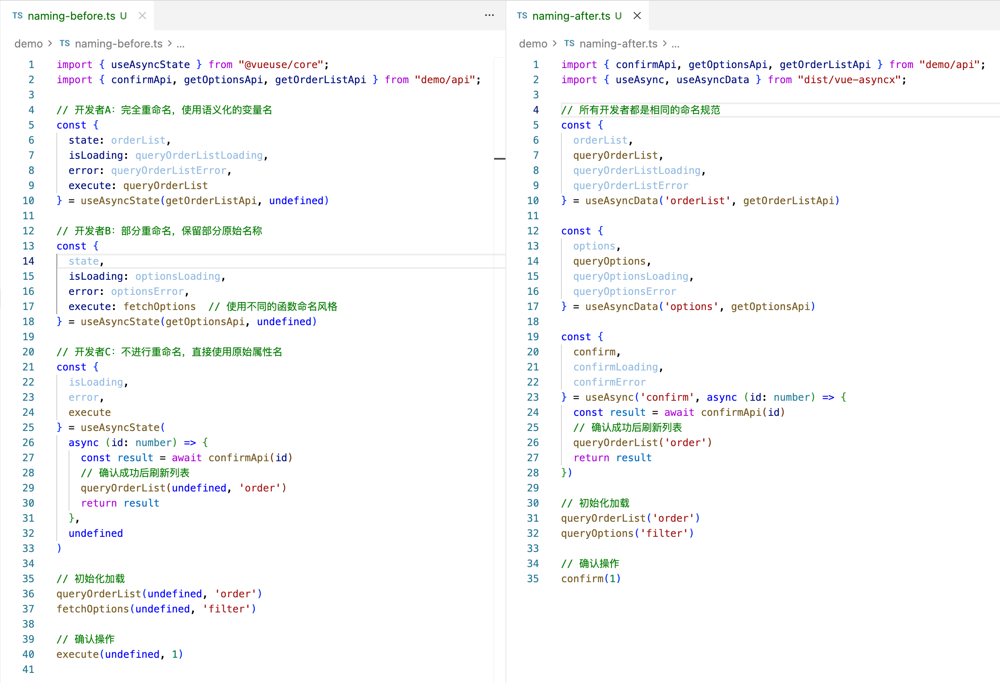
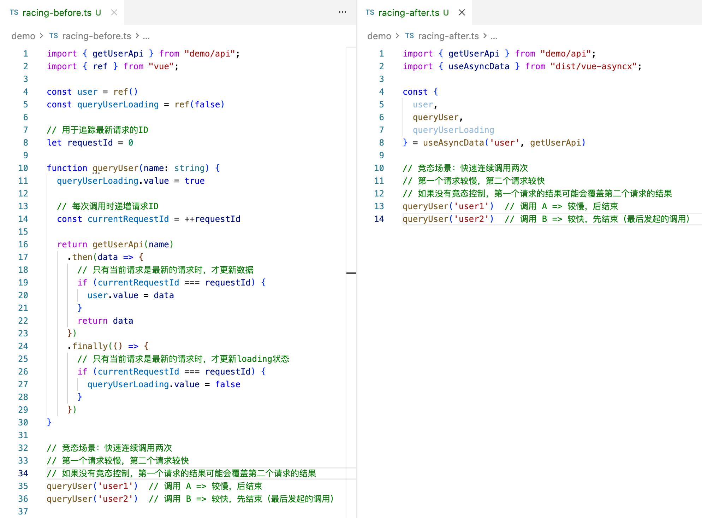

# 简介

Vue Asyncx 是专注异步操作的 Vue 3 组合式工具库

目标是让异步像写诗：不重复、有语义，天然防竞态、自由可扩展


> 只需 30s，异步数据、请求、请求状态，统统搞定

## 极致精简
<a id="code-simplify"></a>

消灭 40% 以上的重复代码，状态自动管理，只留纯粹业务逻辑。


## 命名约定
<a id="naming-convention"></a>

对比 `useAsyncState`，在常见的列表页面、多种请求场景，提供强一致性命名风格。

看命名知业务，代码自文档化，可读性+、效率+，前端架构最爱。



变量名自动提示，无记忆负担，无效率下降。


> 约定优于配置，约定带来效率

## 竞态免疫
<a id="racing-protection"></a>

考虑到要处理竞态条件，即使最简单的实现，也让代码量瞬间提升。而使用 `useAsyncData`，代码无需任何改动。

> `vue-asyncx` 将竞态条件作为第一优先级考虑，所有场景均做了防竞态处理。



## 自由扩展
<a id="addon-free"></a>

`vue-asyncx` 采用插件化架构，可以通过插件轻松拓展能力。

比如，处理请求分组场景。

> 哪怕是分组后的请求，也处在竞态防护下！


```ts
const { 
  confirm, 
  confirmLoading, 
  confirmError, 
  confirmGroup // 分组数据
} = useAsync('confirm', confirmApi, {
  addons: [withAddonGroup({ key: (args) => args[0] })]
});
```

```html
<div v-for="item in items" :key="item.id" class="item">
  <div class="item-info">
    <div class="item-name">{{ item.name }}</div>
  </div>
  <button
    class="btn-confirm"
    :class="{ loading: confirmGroup[item.id]?.loading }"
    :disabled="confirmGroup[item.id]?.loading"
    @click="confirm(item.id)"
  >
    {{ confirmGroup[item.id]?.loading ? '确认中...' : '确认' }}
  </button>
</div>
```